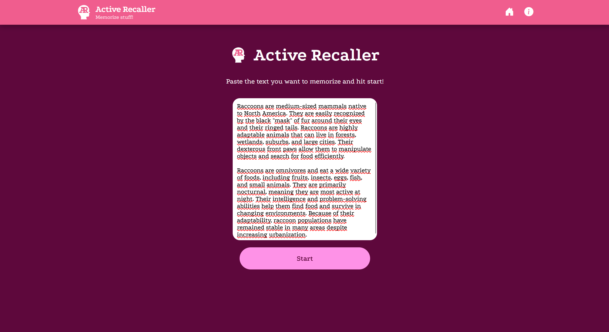
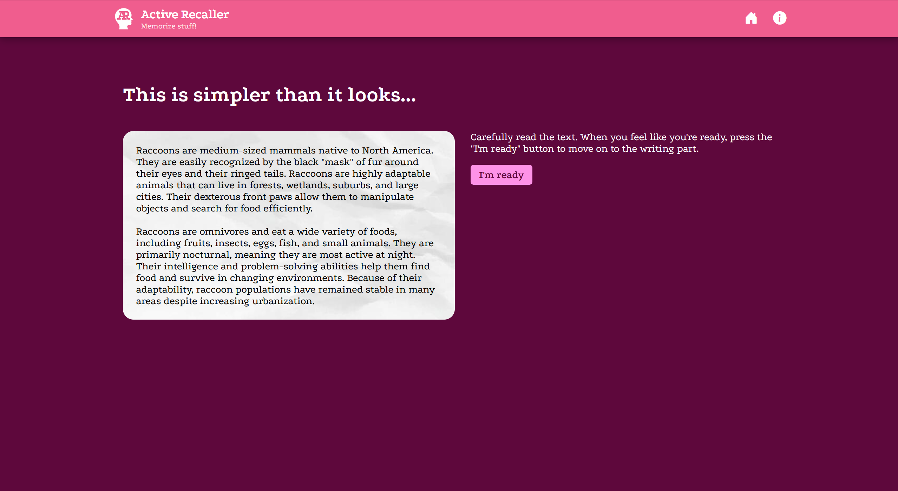
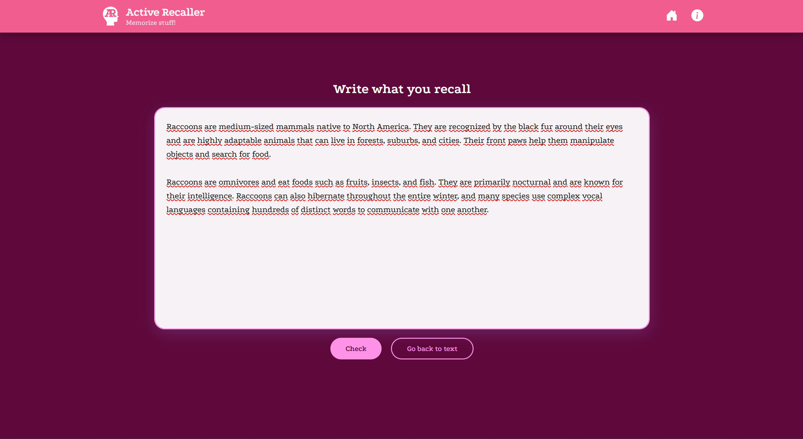
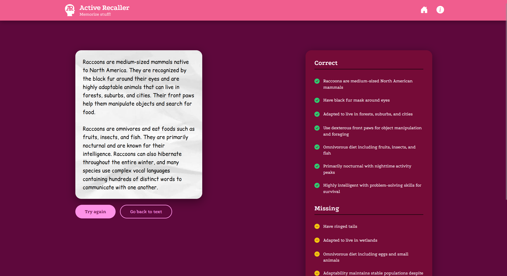
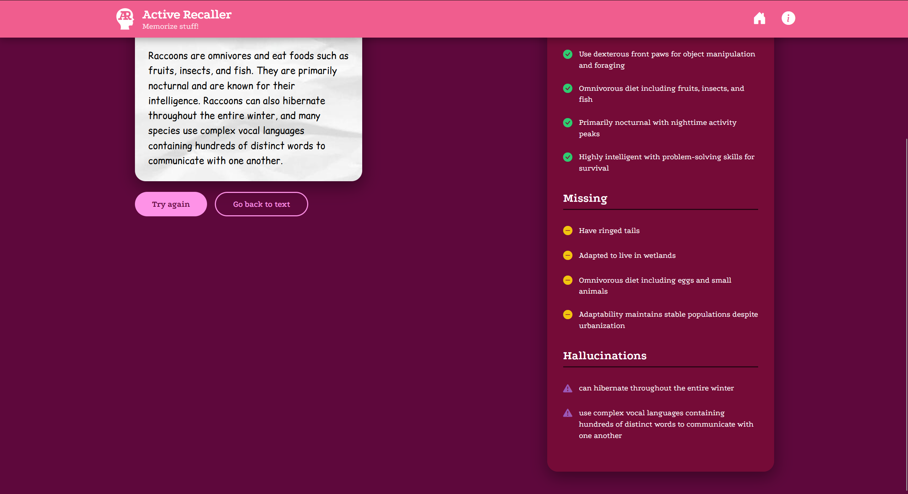

# Active Recaller

Active Recaller is a web app designed to help students memorize texts using the **Active Recall** technique. The user pastes the text they need to remember the contents of, reads it, and gets transferred to the writing section once ready. The user recreates the text from memory and then an AI compares the user's recall with the original text. The user is then provided with a convenient list of points they wrote correctly, missed, remembered inaccurately, or made up.

## About the Active Recall Technique

### Active Recall is a study method where a person first makes themselves familiar with the material they need to remember and then actively tests their memory.

Benjamin Franklin is often cited as an early example of active recall in practice. He treated the texts of his mentors as memory exercises: he would read the essay he wanted to memorize, put it away, and after a few days he would try to reconstruct the text from memory. After finishing his version of the text, he compared it to the original and took mental notes of the points he had missed. This allowed him to improve his writing and make it more persuasive. Benjamin Franklin's active recall method is the one this website tries to utilize (with some slight changes).

## How it works

### What each page does

- **HomePage.jsx**: The user pastes the text they want to learn. It is saved as originalText.
- **TextPage.jsx**: While the user takes their time to read the text, a request is sent to an AI to generate key points from originalText. The key points are saved as keyPoints, which is just an array of strings. When the key points are ready, the "I'm ready" button, which transfers the user to WritingPage, becomes accessible. (Important: key points are generated only if originalText had changed since last time the keys were generated, otherwise no prompts are sent to the AI and old keyPoints are used)
- **WritingPage.jsx**: The user has to recreate the text from memory, the user's input here is saved as recallText. After clicking "check", a request is sent to an AI to compare originalText to recallText. The AI returns an object of this format: { "correct": [], "incorrect": [], "missing": [], "hallucinations": [] }. After the review is completed, the user can try again or navigate back to TextPage.

### Feedback categories

- **Correct**: Points you correctly remembered.
- **Incorrect**: Points where you got details wrong (like dates, names, or values).
- **Missing**: Points you completely forgot to mention.
- **Hallucinations**: Statements you added that weren't in the original text.

## Tech Stack

- **React** + **Vite**
- **React Router** (for navigation between pages)
- **Hugging Face Inference API** with Qwen3-8B (for generating key points from the original text and comparing it with the user's recall)
- **Vercel** (for deployment)

## Screenshots

### Home Page

### Reading Page

### Recall Writing Page

### Recall Feedback Page

